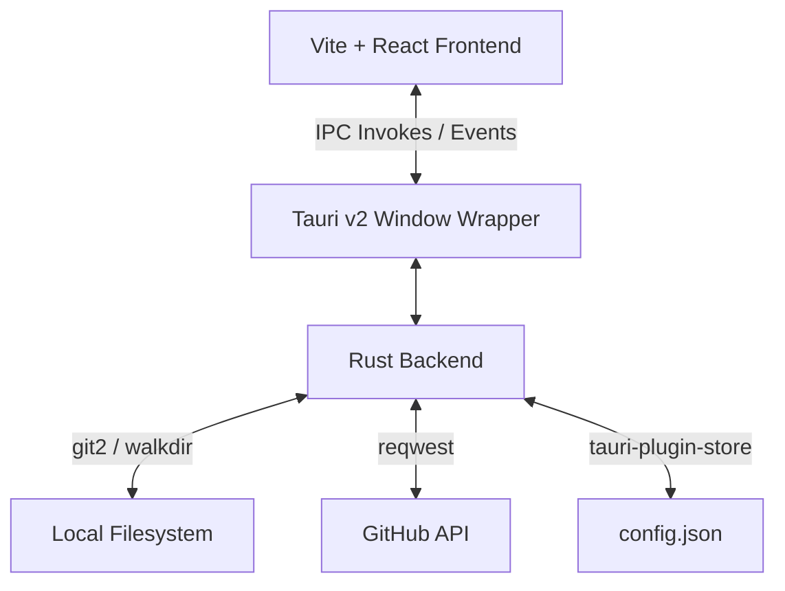

# LagLine

LagLine is a developer-centric desktop dashboard built with **Tauri v2**, **React**, and **TypeScript**. It recursively monitors a local root projects directory to track Git repository statuses, staged/unstaged changes, unpushed commits, and remote syncing against GitHub — all in real time.

Designed with a premium **Sumi-e Ink Wash Dark** aesthetic, LagLine surfaces critical repository attention signals at a glance while keeping the interface clean, focused, and out of your way.

---

## Key Features

### 1. Recursive Project Scanner
- Walks through a configured root projects folder and discovers Git repositories at any depth.
- Implements a **hybrid container traversal algorithm**:
  - If a folder contains `.git` → registered as a Git repository.
  - If a folder contains only subdirectories (no real code files) → treated as a **container** and recursed into (e.g. `gmail-handler/axiom-mail/` will surface `axiom-mail`).
  - If a folder contains actual code files (non-docs) or standard coding subfolders (`src/`, `lib/`, `public/`) → treated as a **non-Git local project** (no further recursion).
  - Ignored doc-only files: `.md`, `.txt`, `LICENSE`, `.gitignore`, `README` — these do not stop traversal.
- Scans run **asynchronously** using Rust background worker threads, keeping the GUI fully responsive.

### 2. Live Local Git Inspection
- Identifies current branch name (handles unborn branches and detached HEAD states).
- Displays uncommitted modifications: Modified (`M`), Added (`A`), Deleted (`D`), and Untracked (`?`) files.
- Extracts short hashes, relative times, and messages of local commits that are ahead of the upstream branch.

### 3. GitHub Remote Comparison
- Leverages the GitHub REST API to retrieve remote commits and calculate commits that need to be pulled (Behind commits).
- Identifies **Diverged** branches (local commits to push AND remote commits to pull) with a warning banner.
- Skips non-GitHub remotes (e.g. GitLab/Bitbucket) and flags them with a badge in the detail pane.
- The **Compare** button (top-right toolbar) triggers an on-demand remote comparison — it is purely read-only; it does not push or pull any code.

### 4. Smart Sidebar with Sorting, Filtering & Search
- **Priority Sorting**: Repositories with uncommitted changes appear at the top. Within groups, sorted by last commit time (newest first).
- **Parent Path Context**: Nested repos show their parent folder path (e.g. `gmail-handler/`) above the folder name so you always know where a project lives.
- **Filter Tabs**: Toggle between **All**, **GitHub**, and **Local/Other** views.
- **Dynamic Subheader**:
  - *All* tab: Shows total scanned folder count.
  - *GitHub* tab: Shows repo count and uncommitted count.
  - *Local/Other* tab: Shows non-Git folder count.
- **Search Bar**: Live text search filters by folder name or path.
- **Hide / Ignore List**: Right-click any repository → **"Hide from list"** to suppress archived or inactive forks. Restore them from Settings.
- **Adjustable Width**: Drag the resize handle between the sidebar and detail panel to any width between 200–500 px.

### 5. Persistent Top-Bar Action Buttons
All three global action buttons are always visible in the top-right corner of the main area, regardless of which folder is selected:
- **Compare** — Fetches remote GitHub data and compares against local state.
- **Rescan** — Re-walks the projects directory and refreshes all repository data.
- **Settings** — Opens the settings drawer.

### 6. Detail Panel
- Clicking a folder in the sidebar shows its full detail view: branch, last commit date, unpushed commits, behind commits, and local file changes.
- Press **`Esc`** anywhere in the app to dismiss the detail view and return to the empty state.
- Two quick-action buttons: **Open in Explorer** and **Open in VS Code**.

### 7. System Tray & Window Persistence
- **Dynamic Tray Icon**: Muted olive when all repos are clean; red when any repo has uncommitted, unpushed, or unpulled changes.
- **Tray Context Menu**: Open LagLine, Rescan Now, Quit.
- **Bounds Memory**: Saves window size and screen position on exit, restoring them on next launch.

### 8. Settings Drawer
- Root path picker via native OS directory dialog.
- GitHub Personal Access Token input (masked).
- Auto-rescan interval selector: Off, 5m, 15m, 30m.
- Hidden repositories restore list.
- App version display.

### 9. Keyboard Shortcuts
| Key | Action |
|---|---|
| `↑` / `↓` | Navigate the sidebar list |
| `Enter` | Open selected repo in VS Code |
| `R` | Trigger a manual rescan |
| `S` | Toggle the Settings drawer |
| `Esc` | Dismiss the current detail view |

---

## Design System

LagLine uses a hand-crafted **Sumi-e Ink Wash Dark** design system — inspired by Japanese ink paintings. The palette avoids harsh blacks and pure whites, instead layering warm near-blacks with low-contrast surfaces to create a calm, focused environment for long work sessions.

### Color Palette

All colors are defined as CSS custom properties in `src/styles/globals.css`.

#### Background Layers
| Token | Value | Usage |
|---|---|---|
| `--bg-base` | `#111210` | App root background |
| `--bg-surface` | `#1a1917` | Sidebar, cards |
| `--bg-raised` | `#222120` | Selected items, hovered surfaces |
| `--bg-wash` | `#2a2825` | Input fields, scrollbar track |

#### Typography Colors
| Token | Value | Usage |
|---|---|---|
| `--text-primary` | `#ffffff` | Headings, repo names |
| `--text-secondary` | `#c5c2bc` | Body text, list items |
| `--text-ghost` | `#7e7b75` | Subheaders, paths, hints |

#### Accent Colors
| Token | Value | Usage |
|---|---|---|
| `--accent-ink` | `rgba(192, 57, 43, 0.6)` | Active selection border |
| `--accent-warm` | `#b5651d` | Warm amber for non-GitHub, dirty status |
| `--accent-muted` | `rgba(192, 57, 43, 0.15)` | Background tint for active items |

#### Status Colors
| Token | Value | Meaning |
|---|---|---|
| `--status-ahead` | `#c0392b` | Unpushed commits (red) |
| `--status-behind` | `#7a6a5a` | Commits to pull (muted brown) |
| `--status-dirty` | `#b5651d` | Uncommitted changes (amber) |
| `--status-clean` | `#4a5a4a` | Clean repository (muted green) |
| `--status-unlinked` | `#3a3530` | No remote set |

#### Borders
| Token | Value | Usage |
|---|---|---|
| `--border-subtle` | `rgba(255,255,255, 0.05)` | Panel separators, card outlines |
| `--border-active` | `rgba(192, 57, 43, 0.3)` | Active hover on buttons |

---

### Typography

Two typefaces are loaded from Google Fonts:

| Role | Font | Usage |
|---|---|---|
| **Monospace** | `DM Mono` (300, 400, 500) | Repository names, branch labels, paths, code-adjacent text |
| **Sans-serif** | `Inter` (300–700) | Body text, buttons, sidebar items |

DM Mono is used wherever technical accuracy is conveyed (commit hashes, file paths, status labels). Inter is used for descriptive and action-oriented text.

---

### Scale & Spacing

| Token | Value | Tailwind equivalent |
|---|---|---|
| `--text-xs` | `11px` | `text-[11px]` |
| `--text-sm` | `13px` | `text-[13px]` |
| `--text-base` | `15px` | `text-[15px]` |
| `--text-lg` | `18px` | `text-[18px]` |
| `--text-xl` | `24px` | `text-[24px]` |
| `--text-2xl` | `32px` | `text-[32px]` |

Spacing follows Tailwind's default 4px scale, with common use at `py-1.5`, `px-3`, `p-4`, `p-6`.

---

### UI Component Patterns

#### Pill Buttons
Global action buttons (Compare, Rescan, Settings) use a **rounded-full pill** shape:
```
px-3 py-1.5 rounded-full text-[11px] font-mono border
bg-bg-surface border-border-subtle text-text-secondary
hover:text-text-primary hover:bg-bg-raised hover:border-border-active
```
Active/loading state adds `animate-pulse bg-bg-raised border-border-active text-text-primary`.

#### Sidebar List Items
Each repository row has a **left-border accent** to indicate selection:
```
border-l-2 border-accent-ink  (selected)
border-l-2 border-transparent (default)
```
Parent path context (for nested repos) is shown above the name in `text-[10px] font-mono text-text-ghost`.

#### Status Dots
Colored 8px dots (`StatusDot` component) provide at-a-glance repository health:
- 🔴 Red — ahead (unpushed commits)
- 🟤 Brown — behind (commits to pull)
- 🟠 Amber — dirty (uncommitted changes)
- 🟢 Muted green — clean
- ⬛ Dark grey — no remote / unlinked
- ⬜ Surface — non-Git folder

#### Scrollbars
Custom Webkit scrollbars are styled globally:
- Width: `8px`
- Thumb: `--text-ghost` with `1px` border gap
- Hover: brightens to `--text-secondary`

#### Grain Overlay
A fixed SVG `fractalNoise` filter layer sits at `z-index: 9999` with `opacity: 0.035`, adding a subtle film-grain texture over the entire UI for depth without visual noise.

---

## Technical Architecture



- **Frontend**: React 19 + TypeScript + Zustand + TailwindCSS v3.
- **Backend**: Rust utilizing:
  - `git2` for local Git database operations.
  - `reqwest` for GitHub API HTTP requests.
  - `tauri-plugin-store` for JSON config persistence.
  - `tauri-plugin-dialog` for native folder selection.
- **State Management**: Zustand flat store (`useRepoStore`) shared across all components.
- **Permissions**: Managed through Tauri v2 granular capability files (`src-tauri/capabilities/`).

---

## Development Setup

### Prerequisites
- Node.js (v18+)
- Rust (stable toolchain via `rustup`)
- Microsoft Edge WebView2 Runtime (pre-installed on Windows 10/11)

### Installation
```bash
# Install npm dependencies
npm install

# Run in development mode (hot reload on both Rust and React)
npm run tauri dev

# Build production installer
npm run build && npx tauri build
```

---

## Configuration

LagLine stores its configuration in a `config.json` file managed by `tauri-plugin-store`. The config schema:

```json
{
  "rootPath": "C:/Users/you/Projects",
  "githubToken": "ghp_...",
  "rescanInterval": 15,
  "ignoredPaths": [
    "C:/Users/you/Projects/archived-fork"
  ]
}
```

| Field | Type | Description |
|---|---|---|
| `rootPath` | `string` | Absolute path to your projects root directory |
| `githubToken` | `string` | GitHub Personal Access Token (repo read scope) |
| `rescanInterval` | `number` | Auto-rescan interval in minutes (0 = off) |
| `ignoredPaths` | `string[]` | List of paths hidden from the sidebar |
